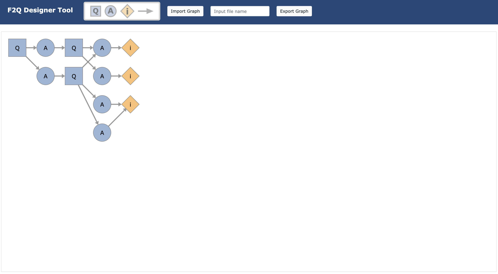
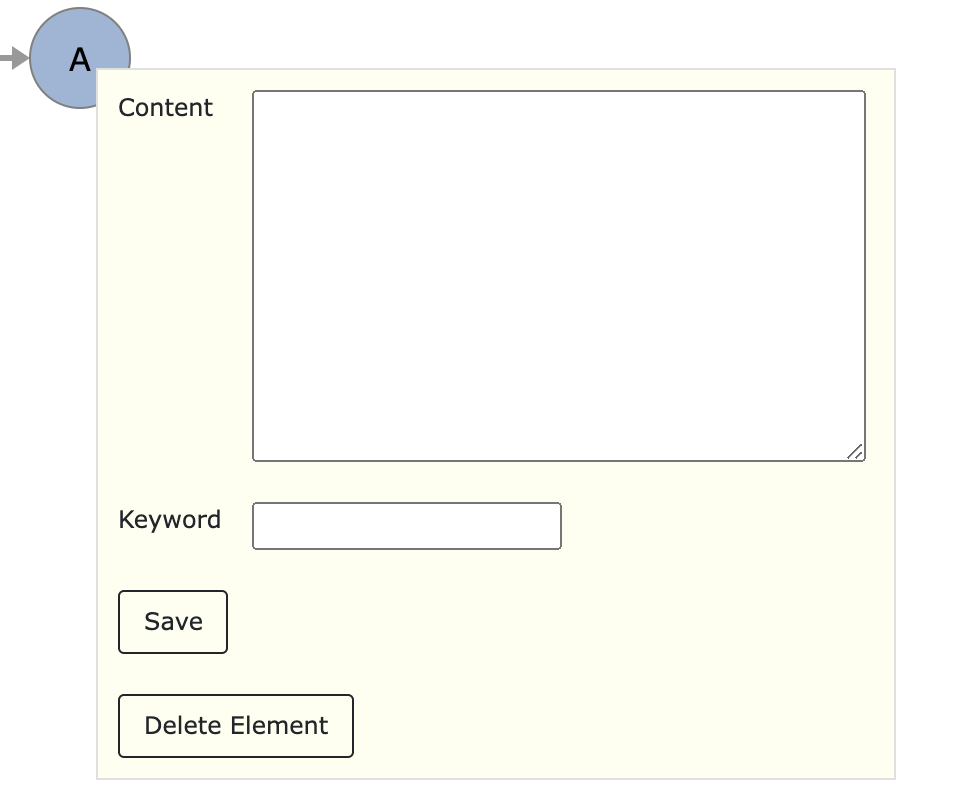
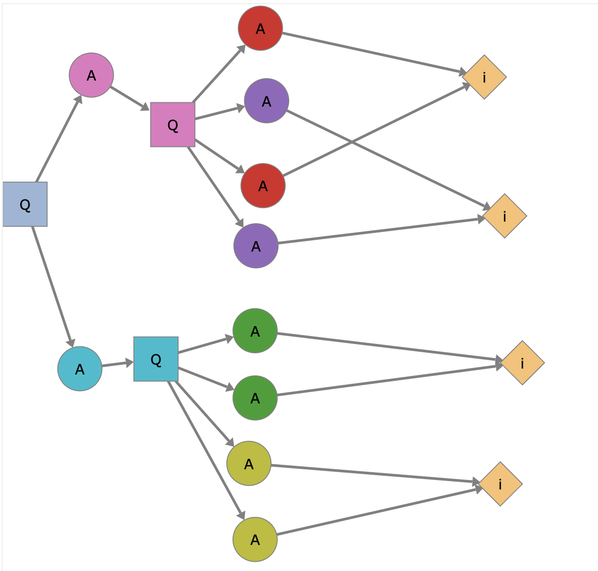

# Designer-Tool

This is the source code for the designer tool for the survey flowchart.

## User Manual

#### 1. Add an element
By clicking on the glyphs on the header (Q/A/i), the system will add a corresponding element to the graph automatically.

#### 2. Add an edge
First, click on the glyph of the arrow, and then select a source node and a target node sequentially.

Notice:
+ A question node cannot be connected to another question node.
+ An answer node cannot be connected to another answer node.
+ An answer node cannot have more than one question node as its child.
+ The information node is always a leaf of the tree.

#### 3. Delete an element or an edge
By double click on an element or an edge, the user is able to remove the element or the edge.

#### 4. Add information to an element
By double click on an element, the user is able to add the content and the keyword to the element. The content will be displayed in the user interface.

#### 5. Export and import a graph
By clicking on the "Export" button, a CSV and a JSON file will be downloaded automatically.

By uploading either the CSV file or the JSON file, the system will recover the saved graph.

Notice:
+ When exporting the graph, please make sure there is only one connected component in the graph.

An example graph is provided in `examples/`:

