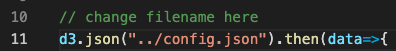

# user-interface

This is the source code for the user interface of the survey.

## Configuration
The interface can be updated via the configuration file `config.json`.
There are four attributes in the file:
*  `chart_path`: the file path and name for the input flowchart.
* `survey_title`: the title of the survey.
* `introduction`: the introduction to the survey, which will be shown at the beginning of the survey.
* `instruction`: the instruction of the survey, which will be shown after the introduction.

If the name of the configuration file is not `config.json`, please make sure to update the input configuration filename at line 11 in the `src/sript.js`:

